## 1. Introduction

<br>

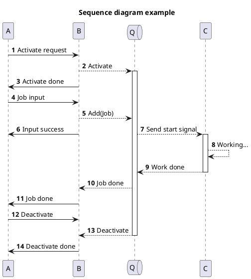

<br>

1. 위 그림과 같이, 정해진 흐름을 따라 그려진 다이어그램을 시퀀스 다이어그램이라 한다.
2. 시퀀스 다이어그램의 구성요소는 아래와 같다.
    1. 객체
    2. 상호작용 (시퀀스)
3. 시퀀스 다이어그램을 통해 아래 항목 등을 파악할 수 있다.
    - 작업 항목
    - 객체간 관계
    - 각 객체의 작업 순서 및 라이프타임
    $\vdots$

<br><br>

## 2. 기본 사용법

<br>

1. `객체`를 선언한 후, `->`, `-->` 등의 시퀀스를 이용해 다이어그램을 그린다.

<br>

<table>
<tr>
<th>Code</th><th>Render</th>
</tr>

<tr>
<td>

```text
@startuml

participant A
participant B

A->B: Hello world!
A<--B: Hello!

@enduml
```
</td>
<td>

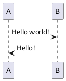
</td>
</tr>
</table>

<br>

## 3. 세부 사용법

<br>

### 3.1. 객체 사용법

<br>

#### 3.1.1. 객체 선언

<br>

<table>

<tr>
<th>Code</th><th>Render</th>
</tr>

<tr>
<td>

```text
@startuml

participant P
actor A
boundary B
control C 
entity E
database D
collections CO
queue Q

@enduml
```
</td>
<td>

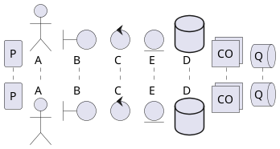
</td>
</tr>

</table>

<br>

#### 3.1.2. 객체 활용

<br>

##### 3.1.2.1. 객체 이름에 특수문자 삽입

<br>

1. `쌍따옴표 ""` 사용하여 지정

<br>

<table>

<tr>
<th>Code</th><th>Render</th>
</tr>

<tr>
<td>

```text
@startuml

participant "P()" as p

@enduml
```
</td>
<td>

```plantuml
@startuml

participant "P()" as p

@enduml
```
</td>
</tr>

</table>

<br>

##### 3.1.2.2. 객체 별칭 지정

<br>

1. `as` 사용하여 지정

<br>

<table>

<tr>
<th>Code</th><th>Render</th>
</tr>

<tr>
<td>

```text
@startuml

participant Participant as p
actor Actor as a

p -> a : hello

@enduml
```
</td>
<td>

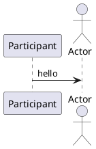
</td>
</tr>

</table>

<br>

##### 3.1.2.3. 객체 순서 지정

<br>

1. `order n` 사용하여 지정

<br>

<table>

<tr>
<th>Code</th><th>Render</th>
</tr>

<tr>
<td>

```text
@startuml

participant P order 3
actor A order 1
boundary B order 2

@enduml
```
</td>
<td>

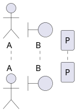
</td>
</tr>

</table>

##### 3.1.2.4. 객체 색상

<br>

1. `#colorname` or `#colorcode` 사용하여 지정

<br>

<table>

<tr>
<th>Code</th><th>Render</th>
</tr>

<tr>
<td>

```text
@startuml

participant P #mediumseagreen
actor A #magenta
boundary B #13ab32

@enduml
```
</td>
<td>

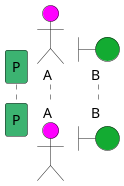
</td>
</tr>

</table>

<br>

##### 3.1.2.5. 객체 세부 선언

<br>

1. `대괄호 []` 사용하여 지정

<br>

<table>

<tr>
<th>Code</th><th>Render</th>
</tr>

<tr>
<td>

```text
@startuml

actor A [
    =Upper
    ----
    ""Lower""
]

@enduml
```
</td>
<td>

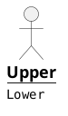
</td>
</tr>

</table>

<br>

### 3.2. 시퀀스 사용법

<br>

#### 3.2.1. 시퀀스 선언

<br>

<table>

<tr>
<th>Code</th><th>Render</th>
</tr>

<tr>
<td>

```text
@startuml

a -> b : message
a --> b
a <-> b
a ->x b
a ->o b
a -\ b
a -/ b
a ->> b
a -\\ b
a -// b
a -> a
a ->(20) b : Slanted

?-> b : Short incoming
[-> b : Long incoming
a ->? : Short outgoing
a ->] : Long outgoing

@enduml
```
</td>
<td>

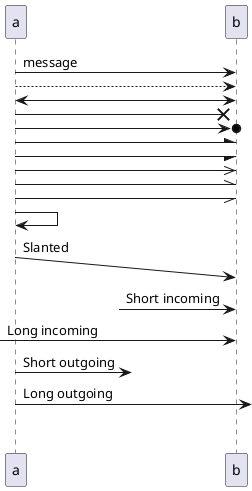
</td>
</tr>

</table>

<br>

#### 3.2.2. 시퀀스 활용 

<br>

##### 3.2.2.1. 시퀀스 색상

<br>

1. `#colorname` or `#colorcode` 사용하여 지정

<br>

<table>

<tr>
<th>Code</th><th>Render</th>
</tr>

<tr>
<td>

```text
@startuml

a -[#cyan]> b : Change by name
a -[#1204fb]> b : Change by code

@enduml
```
</td>
<td>

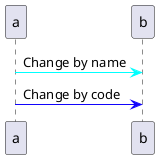
</td>
</tr>

</table>

<br>

##### 3.2.2.2. 여러 줄 메시징

<br>

1. `\n` 사용하여 여러 줄 메시지 삽입

<br>

<table>

<tr>
<th>Code</th><th>Render</th>
</tr>

<tr>
<td>

```text
@startuml

a -> b : This is\nvery long and\nmultiline\nmessage

@enduml
```
</td>
<td>

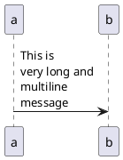
</td>
</tr>

</table>

<br>

##### 3.2.2.3. 메시지 번호

<br>

1. `autonumber` 키워드로 번호 삽입
2. 필드 구분을 위해 `.`, `,`, `;`, `:` 네 가지 Delimiter가 지원된다.

<br>

<table>

<tr>
<th>Code</th><th>Render</th>
</tr>

<tr>
<td>

```text
@startuml

autonumber
a -> b : 1st
a -> b : 2nd

autonumber 10
a -> b : 10th

autonumber 20 10
a -> b : 20th
a -> b : 30th

autonumber stop
a -> b : Temp stop
autonumber resume 1
a -> b : Resume
a -> b : Next

autonumber 1.1.1
a -> b : Change format
a -> b : Next
autonumber inc A
a -> b : Increase first
autonumber inc B
a -> b : Increase second

a -> b : Number of this time is %autonumber%

@enduml
```
</td>
<td>

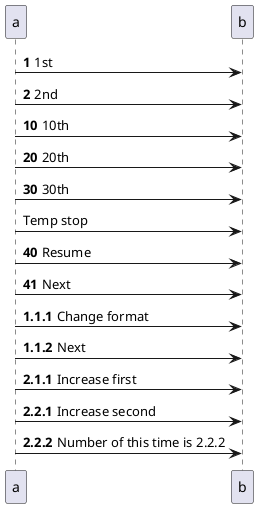
</td>
</tr>

</table>

<br>

### 3.3. 생명선 사용법

<br>

#### 3.3.1. 생명선 선언

<br>

1. `activate` 또는 `++`로 활성화
2. `deactivate` 또는 `--`, `return`으로 종료
    - `return`은 마지막 생명선 활성화 지점의 출발점을 리턴
3. `destroy` 또는 `!!`는 `X` 표시와 함께 완전히 끝났음을 표현
4. 각 키워드는 바로 이전의 시퀀스에 적용

<br>

<table>

<tr>
<th>Code</th><th>Render</th>
</tr>

<tr>
<td>

```text
@startuml

a -> b : Activate
activate b
a -> b : Deactivate
deactivate b

b -> c ++ : Activate
c -> b -- : Deactivate

a -> b ++ : Activate
a -> b ++ : Additional active
return Return

b -> c --++ : Deactivate and activate

b -> c : Destroy
destroy c
a -> b !! : Destroy

@enduml
```
</td>
<td>

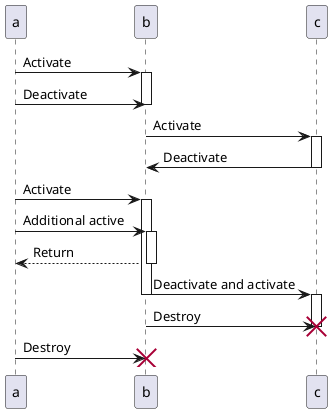
</td>
</tr>

</table>

<br>

#### 3.3.2. 생명선 활용

##### 3.3.2.1. 생명선 색상

<br>

1. `#colorname` or `#colorcode` 사용하여 지정

<br>

<table>

<tr>
<th>Code</th><th>Render</th>
</tr>

<tr>
<td>

```text
@startuml

a -> b ++ #crimson : Activate
b -> c ++ #34ab22 : Activate
return end
return end

@enduml
```
</td>
<td>

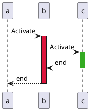
</td>
</tr>

</table>

<br>

### 3.4. Note 사용법

<br>

#### 3.4.1. Note 선언

<br>

1. `note` 키워드를 사용하여 선언
2. 여러 줄의 노트를 추가하는 경우에는 반드시 `end note` 사용

<table>

<tr>
<th>Code</th><th>Render</th>
</tr>

<tr>
<td>

```text
@startuml

a -> b : Message
note left : first note
note right : second note
a ->b : Message
note left
Multi
line
note
end note

note over a : Note over a
note left of b : Note left of b
note right of a : Note right of a
note right of a : Note aligned
/ note right of b : Note aligned 

note over a,b
Note over
selected
objects
end note
note across : Note over all objects

@enduml
```
</td>
<td>

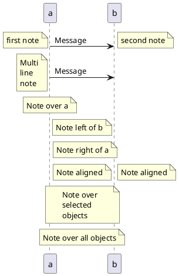
</td>
</tr>

</table>

<br>

#### 3.4.2. Note 활용

<br>

##### 3.4.2.1. Note 모양

<br>

1. `hnote` : 육각형
2. `rnote` : 사각형

<br>

<table>

<tr>
<th>Code</th><th>Render</th>
</tr>

<tr>
<td>

```text
@startuml

hnote over a : hnote
rnote over a : rnote

@enduml
```
</td>
<td>

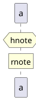
</td>
</tr>

</table>

<br>

##### 3.4.2.2. Note 색상

<br>

1. `#colorname` or `#colorcode` 사용하여 지정

<br>

<table>

<tr>
<th>Code</th><th>Render</th>
</tr>

<tr>
<td>

```text
@startuml

note over a #skyblue : Skyblue
note over a #faacfb : Color code

@enduml
```
</td>
<td>

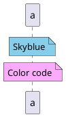
</td>
</tr>

</table>

<br>

### 3.5. Layout

<br>

#### 3.5.1. Mainframe

1. `mainframe`을 사용하여 다이어그램 frame 추가

<br>

<table>

<tr>
<th>Code</th><th>Render</th>
</tr>

<tr>
<td>

```text
@startuml

mainframe main

a -> b : Hello world!

@enduml
```
</td>
<td>

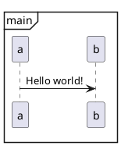
</td>
</tr>

</table>

<br>

#### 3.5.2. Page

1. `newpage`를 사용하여 다이어그램 페이지 추가
2. `newpage` 뒤에 새 페이지의 [`Title`](#353-title) 입력 가능
3. <span style="color:crimson">VSCode에서 Markdown으로 PlantUML 작성 후 HTML 뽑아낼 시 다음 페이지들 정상 출력이 불가
    따로 이미지로 붙여주지 않는 한 uml 분리 권장</span>

<br>

<table>

<tr>
<th>Code</th><th>Render</th>
</tr>

<tr>
<td>

```text
@startuml

a -> b : Hello world!

newpage

a -> b : Next page!

newpage Last page

a -> b : Last page!

@enduml
```
</td>
<td>

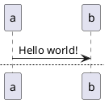
</td>
</tr>

</table>

<br>

#### 3.5.3. Title

<br>

1. `title` 키워드를 이용하여 다이어그램 타이틀 생성
2. `\n` 이용하여 멀티라인 타이틀 생성 가능
3. `title`, `end title` 이용하여 멀티라인 타이틀 생성 가능

<br>

<table>

<tr>
<th>Code</th><th>Render</th>
</tr>

<tr>
<td>

```text
@startuml

title MyTitle

a -> b : Hello world!

@enduml
```
</td>
<td>

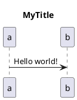
</td>
</tr>

<tr>
<td>

```text
@startuml

title My\nmulti line\ntitle

a -> b : Hello world!

@enduml
```
</td>
<td>

```plantuml
@startuml

title My\nmulti line\ntitle

a -> b : Hello world!

@enduml
```
</td>
</tr>

<tr>
<td>

```text
@startuml

title
My
multi line
title
end title

a -> b : Hello world!

@enduml
```
</td>
<td>

```plantuml
@startuml

title
My
multi line
title
end title

a -> b : Hello world!

@enduml
```
</td>
</tr>

</table>

<br>

#### 3.5.4. Header, footer

<br>

1. `header`, `footer`를 이용하여 머리말, 꼬리말 표시
2. `%page%`, `%lastpage%`를 이용하여 현재 페이지 및 전체 페이지 수 표시 가능
3. <span style="color:crimson">VSCode에서 Markdown으로 PlantUML 작성 후 HTML 뽑아낼 시 다음 페이지들 정상 출력이 불가
    따로 이미지로 붙여주지 않는 한 uml 분리 권장</span>

<br>

<table>

<tr>
<th>Code</th><th>Render</th>
</tr>

<tr>
<td>

```text
@startuml

header Header
footer Footer

title MyTitle

a -> b : Hello world!

@enduml
```
</td>
<td>

```plantuml
@startuml

header Header
footer Footer

title MyTitle

a -> b : Hello world!

@enduml
```
</td>
</tr>

<tr>
<td>

```text
@startuml

header Header
footer Page %page% of %lastpage%

a -> b : Hello world!

newpage

a -> b : Next page!

newpage Last page

a -> b : Last page!

@enduml
```
</td>
<td>

```plantuml
@startuml

header Header
footer Page %page% of %lastpage%

a -> b : Hello world!

newpage

a -> b : Next page!

newpage Last page

a -> b : Last page!

@enduml
```
</td>
</tr>

</table>

<br>

#### 3.5.5. 객체 생성

<br>

1. 시퀀스로 인해 객체가 생성되는 것을 표시하기 위해 사용
2. 시퀀스 바로 전에 `create` 를 사용하여 생성
3. 시퀀스에 `**` 를 이용하여 생성

<br>

<table>

<tr>
<th>Code</th><th>Render</th>
</tr>

<tr>
<td>

```text
@startuml

participant a

create b
a -> b : Hello world!
a -> c ** : Hello world!

@enduml
```
</td>
<td>

```plantuml
@startuml

participant a

create b
a -> b : Hello world!
a -> c ** : Hello world!

@enduml
```
</td>
</tr>

</table>

<br>

#### 3.5.6. 객체 그룹

<br>

1. `box` 및 `end box` 를 이용하여 객체 그룹 형성
2. 그룹 타이틀 및 색상 지정 가능

<br>

<table>

<tr>
<th>Code</th><th>Render</th>
</tr>

<tr>
<td>

```text
@startuml

box
participant a
end box

box "Others" #mediumseagreen
participant b
participant c
end box

a -> b : Hello world!
a -> c : Hello world!

@enduml
```
</td>
<td>

```plantuml
@startuml

box
participant a
end box

box "Others" #mediumseagreen
participant b
participant c
end box

a -> b : Hello world!
a -> c : Hello world!

@enduml
```
</td>
</tr>

</table>

<br>

#### 3.5.7. 객체 Stereotype 추가

<br>

1. `<<` 및 `>>` 를 이용하여 객체에 Stereotype 추가
2. `(Symbol, #color)` 를 이용하여 Spot 추가

<br>

<table>

<tr>
<th>Code</th><th>Render</th>
</tr>

<tr>
<td>

```text
@startuml

participant a << StereoType >>
participant b << (S,#12fcba) >>
participant c << (S,#12fcba) StereoType >>

a -> b : Hello world!

@enduml
```
</td>
<td>

```plantuml
@startuml

participant a << StereoType >>
participant b << (S,#12fcba) >>
participant c << (S,#12fcba) StereoType >>

a -> b : Hello world!

@enduml
```
</td>
</tr>

</table>

<br>

#### 3.5.8. 객체 Footer 제거

<br>

1. `hide footbox` 를 이용하여 객체 footer 제거

<br>

<table>

<tr>
<th>Code</th><th>Render</th>
</tr>

<tr>
<td>

```text
@startuml

hide footbox

a -> b : Hello world!

@enduml
```
</td>
<td>

```plantuml
@startuml

hide footbox

a -> b : Hello world!

@enduml
```
</td>
</tr>

</table>

<br>

#### 3.5.9. 미사용 객체 제거

<br>

1. `hide unlinked` 를 이용하여 미사용 객체 제거

<br>

<table>

<tr>
<th>Code</th><th>Render</th>
</tr>

<tr>
<td>

```text
@startuml

participant a
participant b
participant c

a -> b : Hello world!

@enduml
```
</td>
<td>

```plantuml
@startuml

participant a
participant b
participant c

a -> b : Hello world!

@enduml
```
</td>
</tr>

<tr>
<td>

```text
@startuml

hide unlinked

participant a
participant b
participant c

a -> b : Hello world!

@enduml
```
</td>
<td>

```plantuml
@startuml

hide unlinked

participant a
participant b
participant c

a -> b : Hello world!

@enduml
```
</td>
</tr>

</table>

<br>

#### 3.5.10. 공백, Delay, 구분선

<br>

1. `|||` 및 `||size||` 를 이용하여 공백 추가
2. `...` 및 `... 메시지 ...` 를 이용하여 Delay 추가
3. `====` 및 `== 메시지 ==` 를 이용하여 구분선 추가

<br>

<table>

<tr>
<th>Code</th><th>Render</th>
</tr>

<tr>
<td>

```text
@startuml

a -> b : Hello world!

|||
||50||

...
... Some times later ...

====
== Clear ==

@enduml
```
</td>
<td>

```plantuml
@startuml

a -> b : Hello world!

|||
||50||

...
... Some times later ...

====
== Clear ==

@enduml
```
</td>
</tr>

</table>

<br>

#### 3.5.11. 시퀀스 그룹

<br>

1. 다음 키워드를 사용하여 시퀀스 그룹 생성
    - `alt`, `else` : `if` / `else` 와 같음
    - `opt`
    - `loop`
    - `par`
    - `break`
    - `critical`
    - `group` : `[]` 를 이용하여 추가 문자 출력 가능
2. `end` 를 사용하여 그룹을 닫음
3. `#colorname` or `#colorcode` 사용하여 색상 지정

<br>

<table>

<tr>
<th>Code</th><th>Render</th>
</tr>

<tr>
<td>

```text
@startuml

a -> b : Hello world!

alt case 1
    b -> a : Hello world!

else case 2
    opt send message
        a -> b : Hello?
    end

else case 3
    loop retry
        a -> b : Hello?
    end

else case 4
    group Find new friends [Who will be?]
        a -> c : Hello world!
    end
end

alt#skyblue #31a2f3 Add color
    a -> b : Hello world!
else #af3a7b Color case
    a -> c : Hello world!
end

@enduml
```
</td>
<td>

```plantuml
@startuml

a -> b : Hello world!

alt case 1
    b -> a : Hello world!

else case 2
    opt send message
        a -> b : Hello?
    end

else case 3
    loop retry
        a -> b : Hello?
    end

else case 4
    group Find new friends [Who will be?]
        a -> c : Hello world!
    end
end

alt#skyblue #31a2f3 Add color
    a -> b : Hello world!
else #af3a7b Color case
    a -> c : Hello world!
end

@enduml
```
</td>
</tr>

</table>

<br>

## 4. 기타

<br>

### 4.1. 테마 적용

<br>

1. `!theme` 키워드를 통해 다이어그램에 테마 적용 가능
2. `help themes` 로 적용 가능 테마 리스트 확인 가능
3. 테마 별 상세 정보는 [PlantUML themes Gallery](https://the-lum.github.io/puml-themes-gallery/) 에서 확인

<br>

<table>

<tr>
<th>Code</th><th>Render</th>
</tr>

<tr>
<td>

```text
@startuml

!theme mars

a -> b : Hello world!

@enduml
```
</td>
<td>

```plantuml
@startuml

!theme mars

a -> b : Hello world!

@enduml
```
</td>
</tr>

<tr>
<td>

```text
@startuml
help themes
@enduml
```
</td>
<td>

```plantuml
@startuml
help themes
@enduml
```
</td>
</tr>

</table>

<br>

### 4.2. Skinparam

<br>

1. 다이어그램 내 요소에 대한 스타일 지정
2. `skinparameters`로 사용 가능한 파라미터 목록 확인 가능
3. `skinparam paramname value`로 파라미터 set
4. 자세한 정보는 [Skinparam command](https://plantuml.com/ko/skinparam)을 참조

<br>

<table>

<tr>
<th>Code</th><th>Render</th>
</tr>

<tr>
<td>

```text
@startuml
skinparameters
@enduml
```
</td>
<td>

```plantuml
@startuml
skinparameters
@enduml
```
</td>
</tr>

<tr>
<td>

```text
@startuml

skinparam sequenceMessageAlign center

a -> b : Hello world!
b -> a : Hello world, too!

@enduml
```
</td>
<td>

```plantuml
@startuml

skinparam sequenceMessageAlign center

a -> b : Hello world!
b -> a : Hello world, too!

@enduml
```
</td>
</tr>

<tr>
<td>

```text
@startuml

skinparam ParticipantPadding 30
skinparam BoxPadding 20

box
participant a
end box

box "Others" #mediumseagreen
participant b
participant c
end box

a -> b : Hello world!
a -> c : Hello world!

@enduml
```
</td>
<td>

```plantuml
@startuml

skinparam ParticipantPadding 30
skinparam BoxPadding 20

box
participant a
end box

box "Others" #mediumseagreen
participant b
participant c
end box

a -> b : Hello world!
a -> c : Hello world!

@enduml
```
</td>
</tr>

</table>

<br>

### 4.3. teoz rendering engine

<br>

1. `PlantUML`의 몇몇 기능은 `teoz rendering engine`을 통해 확장이 가능하다.
2. `teoz rendering engine`을 사용하기 위해서는 `!pragma teoz true` 를 입력해주면 된다.

<br>

#### 4.3.1. Nested object group

<br>

<table>

<tr>
<th>Code</th><th>Render</th>
</tr>

<tr>
<td>

```text
@startuml

!pragma teoz true

box
participant a

box "Others" #mediumseagreen
participant b
participant c

end box
end box

a -> b : Hello world!
a -> c : Hello world!

@enduml
```
</td>
<td>

```plantuml
@startuml

!pragma teoz true

box
participant a

box "Others" #mediumseagreen
participant b
participant c

end box
end box

a -> b : Hello world!
a -> c : Hello world!

@enduml
```
</td>
</tr>

</table>

<br>

#### 4.3.2. 동시성 확장

<br>

1. `&` 기호를 사용하여 동시에 일어나는 요소를 표현할 수 있다.

<br>

<table>

<tr>
<th>Code</th><th>Render</th>
</tr>

<tr>
<td>

```text
@startuml

!pragma teoz true

a -> b : Hello world!
& b -> c : Hello world!

note left of a : I'm a
& note right of b : I'm b

@enduml
```
</td>
<td>

```plantuml
@startuml

!pragma teoz true

a -> b : Hello world!
& b -> c : Hello world!

note left of a : I'm a
& note right of b : I'm b

@enduml
```
</td>
</tr>

</table>

<br>

#### 4.3.3. Anchor

<br>

1. `{start}`, `{end}` 지정을 통해 Time gap 표시를 할 수 있다.

<br>

<table>

<tr>
<th>Code</th><th>Render</th>
</tr>

<tr>
<td>

```text
@startuml

!pragma teoz true
skinparam responseMessageBelowArrow true

{start} a -> b : Hello world!
||40||
{end} b -> a : Hi!

{start} <-> {end} : Duration

@enduml
```
</td>
<td>

```plantuml
@startuml

!pragma teoz true
skinparam responseMessageBelowArrow true

{start} a -> b : Hello world!
||40||
{end} b -> a : Hi!

{start} <-> {end} : Duration

@enduml
```
</td>
</tr>

</table>