## 1. Introduction

<br>

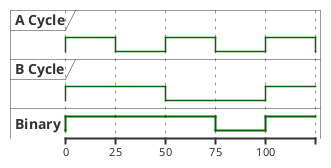

1. 위의 그림과 같이, 타이밍 다이어그램은 일련의 시간 흐름 안에서 각각의 상태를 나타낼 수 있다.
2. `Sequence diagram`, `Use case diagram` 등과는 다른 사용법을 가지고 있으며 개발 중인 기능이라고 한다.
3. 타이밍 다이어그램은 `객체`와 `상태` 2 가지가 주요 요소이다.

<br>

## 2. 기본 사용법

<br>

<table>
<tr>
<th>Code</th><th>Render</th>
</tr>

<tr>
<td>

```text
@startuml

analog "Analog" as an
binary "Binary" as bi
concise "Concise" as co
robust "Robust" as ro
clock "Clock" as cl with period 10
clock "Clock" as cl with period 20 pulse 15 offset 15

' `@` 기호를 이용하여 시점, `is`를 이용하여 상태 표시

@0
an is 0
bi is low
co is Idle
ro is Idle

@15
an is 5
bi is high
co is "Any string"
ro is Any

@30
an is 0
bi is low
co is End
ro is End

@35
@enduml
```
</td>
<td>

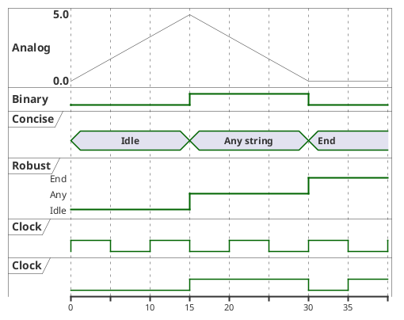
</td>
</tr>
</table>

<br>

## 3. 상세 사용법

<br>

### 3.1. Participant

<br>

#### 3.1.1. Initialize

<br>

<table>
<tr>
<th>Code</th><th>Render</th>
</tr>

<tr>
<td>

```text
@startuml

concise A
concise B

' Define initial state before define details

A is None
B is Disconnected

@10

A is User
B is Connected

@enduml
```

</td>
<td>

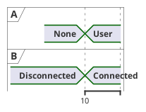

</td>
</tr>
</table>

<br>

#### 3.1.2. Intricated state

<br>

<table>
<tr>
<th>Code</th><th>Render</th>
</tr>

<tr>
<td>

```text
@startuml

' Could use for robust, binary

robust R
binary "Binary" as B

@0
R is 0
B is high

@5
R is {0,1}
B is {low,high}

@10
R is 2
B is low

@enduml
```

</td>
<td>

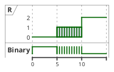

</td>
</tr>
</table>

<br>

#### 3.1.3. Hidden state

<br>

<table>
<tr>
<th>Code</th><th>Render</th>
</tr>

<tr>
<td>

```text
@startuml

' Could use but not working well
analog "Analog" as A
binary "Binary" as B

' Coule use
concise C
robust R

' Could not use for clock
clock CL with period 5

@5
A is 10
B is high
C is Show
R is 1

@10
A is {hidden}
B is {hidden}
C is {hidden}
R is {hidden}

@15
A is 10
B is high
C is Show
R is 1

@enduml
```

</td>
<td>

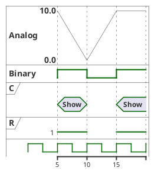

</td>
</tr>
</table>

<br>

### 3.2. Timing (X Axis)

<br>

#### 3.2.1. Absolute & Relative Time

<br>

<table>
<tr>
<th>Code</th><th>Render</th>
</tr>

<tr>
<td>

```text
@startuml

clock cl1 with period 1
clock cl2 with period 3

' Absolute time
@1
@5

' Relative time
@+5
@+3

@enduml
```

</td>
<td>

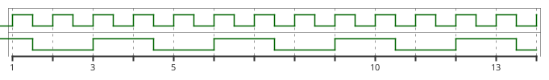

</td>
</tr>
</table>

<br>

#### 3.2.2. Anchor time

<br>

<table>
<tr>
<th>Code</th><th>Render</th>
</tr>

<tr>
<td>

```text
@startuml

clock cl1 with period 1
clock cl2 with period 2
concise co

' Use `:` for anchor time
@1 as :one
@+5 as :plusfive
@:plusfive-2 as :plusthree

@:one
co is one
@:plusfive
co is plusfive
@:plusthree
co is plusthree
@:plusthree+5
co is "plusthree+5"

@enduml
```

</td>
<td>

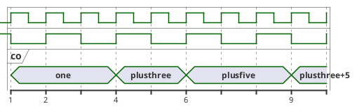

</td>
</tr>
</table>

<br>

#### 3.2.3. Date time

<br>

<table>
<tr>
<th>Code</th><th>Render</th>
</tr>

<tr>
<td>

```text
@startuml

concise C

@2023/06/25
C is Yesterday

@2023/06/26
C is Today

@2023/06/27
C is Tomorrow

@enduml
```

</td>
<td>

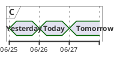

</td>
</tr>

<tr>
<td>

```text
@startuml

concise C

@8:00:00
C is 8AM

@11:00:00
C is 11AM

@13:00:00
C is 1PM

@enduml
```

</td>
<td>

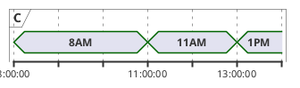

</td>
</tr>
</table>

<br>

#### 3.2.4. Scaling

<br>

<table>
<tr>
<th>Code</th><th>Render</th>
</tr>

<tr>
<td>

```text
@startuml

clock CL with period 10

' For value axis
scale 10 as 30 pixels

@10
@+20
@+20

@enduml
```

</td>
<td>

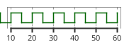

</td>
</tr>

<tr>
<td>

```text
@startuml

concise C

' For Date time axis
' 1 month is scaled to 100 pixels
scale 2592000 as 100 pixels

@2023/03/01
C is 03.01

@2023/04/01
C is 04.01

@2023/05/01
C is 05.01

@enduml
```

</td>
<td>

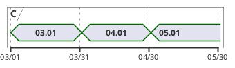

</td>
</tr>

<tr>
<td>

```text
@startuml

hide time-axis
clock CL with period 10

@20

@enduml
```

</td>
<td>

```plantuml
@startuml

hide time-axis
clock CL with period 10

@20

@enduml
```

</td>
</tr>
</table>

<br>

### 3.3. Declaring method

<br>

#### 3.3.1. Chronologic (Default)

<br>

<table>
<tr>
<th>Code</th><th>Render</th>
</tr>

<tr>
<td>

```text
@startuml

concise "Concise" as co
robust "Robust" as ro

@5
co is high
ro is high

@10
co is low

@15
ro is low

@enduml
```

</td>
<td>

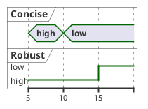

</td>
</tr>

</table>

<br>

#### 3.3.2. Participant

<br>

<table>
<tr>
<th>Code</th><th>Render</th>
</tr>

<tr>
<td>

```text
@startuml

binary "Binary" as B
concise C

@B
0 is low
10 is high
15 is low

@C
0 is None
5 is Activate
10 is Deactivate

@enduml
```

</td>
<td>

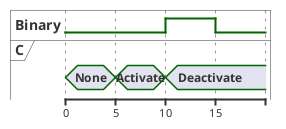

</td>
</tr>
</table>

<br>

### 3.4. Message

<br>

<table>
<tr>
<th>Code</th><th>Render</th>
</tr>

<tr>
<td>

```text
@startuml

analog "Analog" as an
binary "Binary" as bi
concise "Concise" as co
robust "Robust" as ro

' Could not use message to clock
clock "Clock" as cl with period 20 pulse 15 offset 15

@5
bi is high
co is high
an is 10
ro is high

@10
bi is low
co is low
bi -> co : low


@15
an is 0
ro is low
an -> ro : low

@enduml
```

</td>
<td>

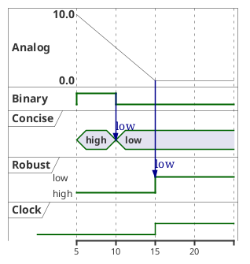
</td>
</tr>

</table>

<br>

### 3.5. Notes (Concise only)

<br>

<table>
<tr>
<th>Code</th><th>Render</th>
</tr>

<tr>
<td>

```text
@startuml

concise C

@50
C is A.State

' Could use notes at Top or Bottom
note top of C : Here is 50
note bottom of C : Here also 50

@enduml
```

</td>
<td>

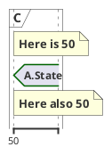

</td>
</tr>
</table>

<br>

### 3.6. Constraints

<br>

<table>
<tr>
<th>Code</th><th>Render</th>
</tr>

<tr>
<td>

```text
@startuml

concise C

@C
0 is Idle
+50 is Loading
+100 is Initializing
+50 is Drawing

C@0 <-> @+50 : 50ms
C@50 <-> @+100 : 100ms
C@150 <-> @+50 : 50ms

@enduml
```

</td>
<td>

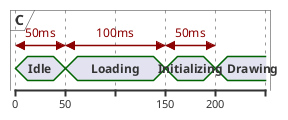

</td>
</tr>
</table>

<br>

### 3.7. Texts

<br>

<table>
<tr>
<th>Code</th><th>Render</th>
</tr>

<tr>
<td>

```text
@startuml

title TitleSample

header: HeaderSample
footer: FooterSample

legend
LegendSample
end legend

caption CaptionSample

clock CL with period 10

@30

@enduml
```

</td>
<td>

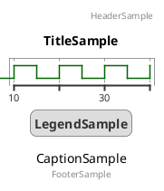

</td>
</tr>
</table>

<br>

## 4. ETC

<br>

### 4.1. Compact mode

<br>

<table>
<tr>
<th>Code</th><th>Render</th>
</tr>

<tr>
<td>

```text
@startuml

' Global mode
mode compact

robust R
concise C

R has 0,1,2

@10
R is 1
C is A

@20
R is 2
C is B

@enduml
```

</td>
<td>

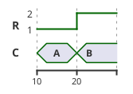

</td>
</tr>

<tr>
<td>

```text
@startuml

' Local mode

compact robust R1
robust R2

@10
R1 is 1
R2 is A

@20
R1 is 2
R2 is B

@enduml
```

</td>
<td>

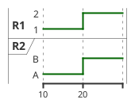

</td>
</tr>

</table>

<br>

### 4.2. Color

<br>

#### 4.2.1. Concise

<table>
<tr>
<th>Code</th><th>Render</th>
</tr>

<tr>
<td>

```text
@startuml

concise C

@10
C is color #gold

@enduml
```

</td>
<td>

```plantuml
@startuml

concise C

@10
C is color #gold

@enduml
```

</td>
</tr>
</table>

<br>

#### 4.2.2. Line color

<br>

<table>
<tr>
<th>Code</th><th>Render</th>
</tr>

<tr>
<td>

```text
@startuml

<style>
timingDiagram{
    .crimson{
        LineColor crimson
    }
    .skyblue{
        LineColor skyblue
        LineThickness 3
    }
    constraintArrow
    {
        LineStyle 2-1
        LineThickness 5
        LineColor green
    }
}
</style>

binary "Line1" as B1 <<crimson>>
binary "Line2" as B2 <<skyblue>>

@10
B1 is low
B2 is high

@15

B1@10 <-> @+10 : 5

@enduml
```

</td>
<td>

```plantuml
@startuml

<style>
timingDiagram{
    .crimson{
        LineColor crimson
    }
    .skyblue{
        LineColor skyblue
        LineThickness 3
    }
    constraintArrow
    {
        LineStyle 2-1
        LineThickness 5
        LineColor green
    }
}
</style>

binary "Line1" as B1 <<crimson>>
binary "Line2" as B2 <<skyblue>>

@10
B1 is low
B2 is high

@15

B1@10 <-> @+10 : 5

@enduml
```

</td>
</tr>
</table>

<br>

#### 4.2.3. Highlight

<br>

<table>
<tr>
<th>Code</th><th>Render</th>
</tr>

<tr>
<td>

```text
@startuml

clock CL with period 10

@40

highlight 20 to 40 #grey;line:pink : Hightlight caption

@enduml
```

</td>
<td>

```plantuml
@startuml

clock CL with period 10

@40

highlight 20 to 40 #grey;line:pink : Hightlight caption

@enduml
```

</td>
</tr>
</table>

<br>

#### 4.2.4. Background color

<br>

<table>
<tr>
<th>Code</th><th>Render</th>
</tr>

<tr>
<td>

```text
@startuml

<style>
timingDiagram{
    document{
        BackGroundColor skyblue
    }
}
</style>

clock CL with period 10

@40

@enduml
```

</td>
<td>

```plantuml
@startuml

<style>
timingDiagram{
    document{
        BackGroundColor skyblue
    }
}
</style>

clock CL with period 10

@40

@enduml
```

</td>
</tr>
</table>

<br>

## 5. Reference

1. [PlantUML - Timing Diagram](https://plantuml.com/en-dark/timing-diagram)