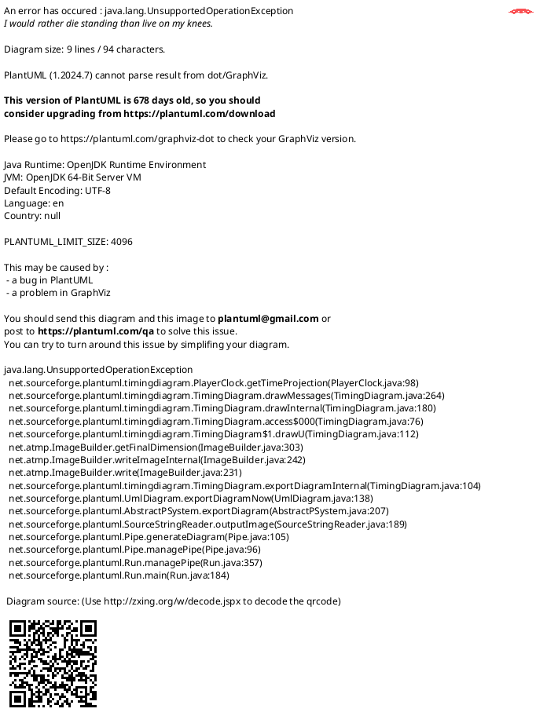

## 1. Introduction

<br>


1. 위의 그림과 같이, 타이밍 다이어그램은 일련의 시간 흐름 안에서 각각의 상태를 나타낼 수 있다.
2. `Sequence diagram`, `Use case diagram` 등과는 다른 사용법을 가지고 있으며 개발 중인 기능이라고 한다.
3. 타이밍 다이어그램은 `객체`와 `상태` 2 가지가 주요 요소이다.

<br>

## 2. 기본 사용법

<br>

<table>
<tr>
<th>Code</th><th>Render</th>
</tr>

<tr>
<td>

```text
@startuml

analog "Analog" as an
binary "Binary" as bi
concise "Concise" as co
robust "Robust" as ro
clock "Clock" as cl with period 20 pulse 15 offset 15

' `@` 기호를 이용하여 시점, `is`를 이용하여 상태 표시

@0
an is 0
bi is low
co is Idle
ro is Idle

@15
an is 5
bi is high
co is "Any string"
ro is Any

@30
an is 0
bi is low
co is End
ro is End

@35
@enduml
```
</td>
<td>


</td>
</tr>
</table>

<br>

## 3. 상세 사용법

<br>

<table>
<tr>
<th>Code</th><th>Render</th>
</tr>

<tr>
<td>

</td>
<td>


</td>
</tr>

<tr>
<td>
</td>
<td>
</td>
</tr>
</table>