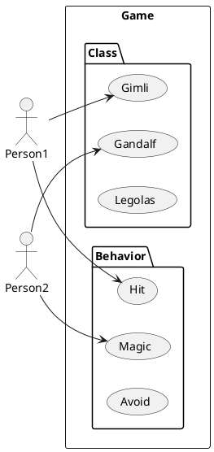
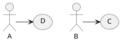

## 1. Introduction

<br>



<br>

1. `Use case diagram`이란, 시스템이 수행하는 작업에 대한 모델링을 의미한다.
   특히 `High level` 영역에서의 기능과 범위를 나타낸다.
2. 사용자를 중심으로 시스템과의 상호작용을 요약하므로, 자세한 정보는 나타나지 않는다.
3. 기본적인 다이어그램 그리기 방법은 `Sequence diagram`으로부터 출발한다.

<br>

## 2. 기본 사용법

<br>

1. Actor 정의 : `:이름:` or `actor 이름`
2. Use case 정의 : `(이름)` or `usecase 이름`

<br>

<table>
<tr>
<th>Code</th><th>Render</th>
</tr>

<tr>
<td>

```text
@startuml

actor A
:B:

usecase C
(D)

A -> D
B -> C

@enduml
```
</td>
<td>


</td>
</tr>
</table>

<br>

## 3. Actor 종류

