## 1. Introduction

<br>

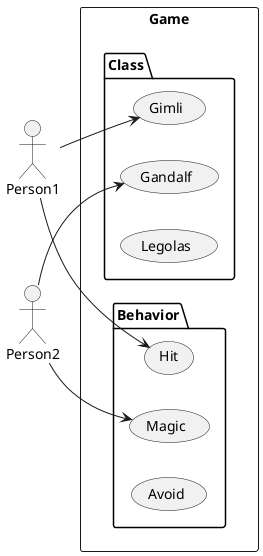

<br>

1. `Use case diagram`이란, 시스템이 수행하는 작업에 대한 모델링을 의미한다.
   특히 `High level` 영역에서의 기능과 범위를 나타낸다.
2. 사용자를 중심으로 시스템과의 상호작용을 요약하므로, 자세한 정보는 나타나지 않는다.
3. 기본적인 다이어그램 그리기 방법은 `Sequence diagram`으로부터 출발한다.

<br>

## 2. 기본 사용법

<br>

1. Actor 정의 : `:이름:` or `actor 이름`
2. Use case 정의 : `(이름)` or `usecase 이름`

<br>

<table>
<tr>
<th>Code</th><th>Render</th>
</tr>

<tr>
<td>

```text
@startuml

actor A
:B:

usecase C
(D)

A -> D
B -> C : Text

@enduml
```
</td>
<td>

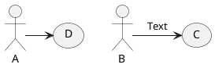
</td>
</tr>
</table>

<br>

## 3. 상세 사용법

<br>

### 3.1. Actor 종류

<br>

<table>
<tr>
<th>Code</th><th>Render</th>
</tr>

<tr>
<td>

```text
@startuml

:A:
:B:/

' #[color|back:color];line:color;line.[bold|dashed|dotted];text:color
:C: #skyblue;line:blue;line.dotted;text:magenta

@enduml
```
</td>
<td>

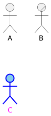
</td>
</tr>

<tr>
<td>

```text
@startuml

skinparam actorStyle awesome
:A:

@enduml
```
</td>
<td>

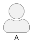
</td>
</tr>

<tr>
<td>

```text
@startuml

skinparam actorStyle awesome
:A:

@enduml
```
</td>
<td>

```plantuml
@startuml

skinparam actorStyle Hollow
:A:

@enduml
```
</td>
</tr>

</table>

<br>

### 3.2. Use case 사용법

<br>

<table>
<tr>
<th>Code</th><th>Render</th>
</tr>

<tr>
<td>

```text
@startuml

usecase A
(B)

' #[color|back:color];line:color;line.[bold|dashed|dotted];text:color
usecase C #gold;line:aqua;line.dashed;text:crimson

@enduml
```
</td>
<td>

```plantuml
@startuml

usecase A
(B)

' #[color|back:color];line:color;line.[bold|dashed|dotted];text:color
usecase C #gold;line:aqua;line.dashed;text:crimson

@enduml
```
</td>
</tr>

<tr>
<td>

```text
@startuml

usecase "It is very very long long\ndescription for makes it\nseveral lines!" as c
' 또는
usecase c2 as "It could be this way also.
Could makes multiline easier,
visibility also better.
--
`--`, `==`, `..Description..` possible for dividing sections
==
..Done.."

@enduml
```
</td>
<td>

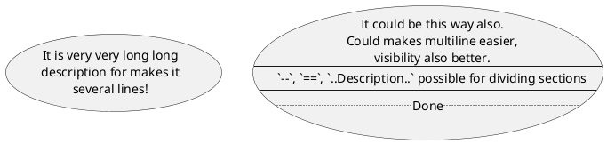
</td>
</tr>
</table>

<br>

### 3.3. 화살표 사용법

<br>

<table>
<tr>
<th>Code</th><th>Render</th>
</tr>

<tr>
<td>

```text
@startuml

:A:

(a)
(b)
(c)

' `-` 대시가 많아질 수록 연결선이 길어짐
A -> a
A --> b
A ---> c

@enduml
```
</td>
<td>

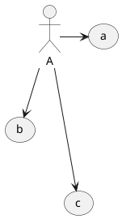
</td>
</tr>

<tr>
<td>

```text
@startuml

:A:
:B:

(a)
(b)

A -> a

' `.` 이용하여 모양 변경 가능
A .> b

' `-|>` 이용하여 확장의 의미로 사용 가능
A -|> B

@enduml
```
</td>
<td>

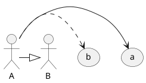
</td>
</tr>

<tr>
<td>

```text
@startuml

:A:

(up)
(down)
(left)
(right)

a -up-> up
a -down-> down
a -left-> left
a -right-> right

@enduml
```
</td>
<td>

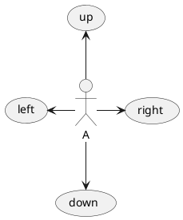
</td>
</tr>

</table>

<br>

### 3.4. Package 사용법

<br>

<table>
<tr>
<th>Code</th><th>Render</th>
</tr>

<tr>
<td>

```text
@startuml

package People{
    actor A
    actor B
}

rectangle Tasks{
    usecase a
    usecase b
}

A -> a
B -> b

@enduml
```
</td>
<td>

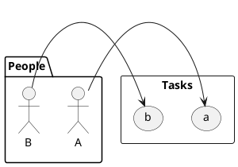
</td>
</tr>

</table>

<br>

### 3.5. Note 사용법

<br>

<table>
<tr>
<th>Code</th><th>Render</th>
</tr>

<tr>
<td>

```text
@startuml

actor A
actor B

note top of A : Top
note bottom of A : Bottom
note left of A : Left
note right of B : Right

note "Connected" as c

' Use `..` symbol for link objects
A..c
c..B

@enduml
```
</td>
<td>

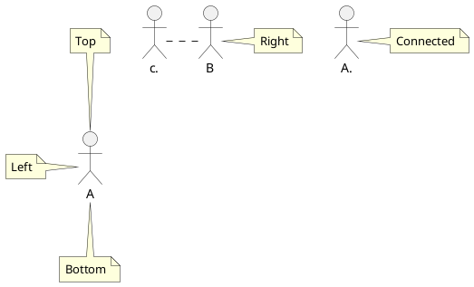
</td>
</tr>

</table>

<br>

### 3.6. Stereotype

<br>

<table>
<tr>
<th>Code</th><th>Render</th>
</tr>

<tr>
<td>

```text
@startuml

actor A <<People>>

usecase a <<Action>>

@enduml
```
</td>
<td>

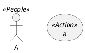
</td>
</tr>

</table>

<br>

### 3.7. Diagram 정렬

<br>

<table>
<tr>
<th>Code</th><th>Render</th>
</tr>

<tr>
<td>

```text
@startuml

top to bottom direction

actor A
actor B

usecase a
usecase b

A --> a
B --> b

@enduml
```
</td>
<td>

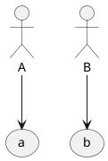
</td>
</tr>

<tr>
<td>

```text
@startuml

left to right direction

actor C
actor D

usecase c
usecase d

C --> c
D --> d

@enduml
```
</td>
<td>

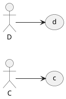
</td>
</tr>

</table>

<br>

### 3.8. JSON data 표현

<br>

<table>
<tr>
<th>Code</th><th>Render</th>
</tr>

<tr>
<td>

```text
@startuml

json J{
    "Name" : "A",
    "Score" : ["90", "80"],
    "Class" : ["Math", "History"]
}

@enduml
```
</td>
<td>

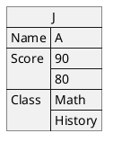
</td>
</tr>
</table>