# PlantUML - Sequence diagram

 

## 1. Introduction

 

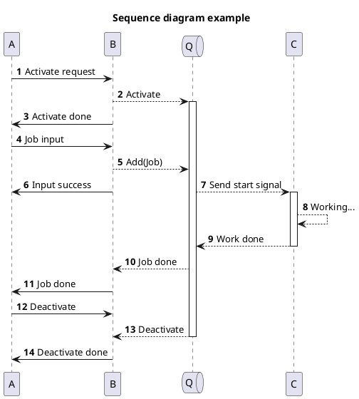

 

1. 위 그림과 같이, 정해진 흐름을 따라 그려진 다이어그램을 시퀀스 다이어그램이라 한다.
2. 시퀀스 다이어그램의 구성요소는 아래와 같다.
    1. 객체
    2. 상호작용 (시퀀스)
3. 시퀀스 다이어그램을 통해 아래 항목 등을 파악할 수 있다.
    - 작업 항목
    - 객체간 관계
    - 각 객체의 작업 순서 및 라이프타임 
    $\vdots$

  

## 2. 기본 사용법

 

<table>
<tr>
<th>Code</th><th>Render</th>
</tr>

<tr>
<td>
@startuml  
participant A 
participant B 
 
A->B: Hello world! 
A<-B: Hello!  
@enduml
</td>
<td>

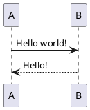
</td>
</tr>
</table>

 

1. `객체`를 선언한 후, `->`, `-->` 등의 시퀀스를 이용해 다이어그램을 그린다.

 

## 3. 세부 사용법

 

### 3.1. 객체 사용법

 

#### 3.1.1. 객체 선언

 

<table>
<colgroup>
    <col style="width: 30%">
    <col style="width: 50%">
<colgroup>

<tr>
<th>Code</th><th>Render</th>
</tr>

<tr>
<td>
@startuml  
participant P 
actor A 
boundary B 
control C 
entity E 
database D 
collections CO 
queue Q  
@enduml
</td>
<td>

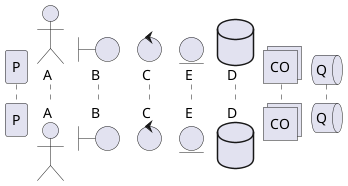
</td>
</tr>

</table>

 

#### 3.1.2. 객체 활용

 

<table>
<colgroup>
    <col style="width: 30%">
    <col style="width: 50%">
<colgroup>

<tr>
<th>객체 이름에 특수문자 삽입</th><th>Render</th>
</tr>

<tr>
<td>

`쌍따옴표 ""` 사용하여 지정

@startuml  
participant "P()" as p  
@enduml
</td>
<td>

```plantuml
@startuml
participant "P()" as p
@enduml
```
</td>
</tr>

</table>

 

<table>
<colgroup>
    <col style="width: 30%">
    <col style="width: 50%">
<colgroup>

<tr>
<th>객체 별칭 지정</th><th>Render</th>
</tr>

<tr>
<td>

`as` 사용하여 지정

@startuml  
participant Participant as p 
actor Actor as a  
@enduml
</td>
<td>

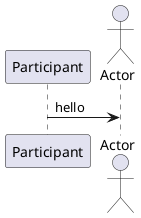
</td>
</tr>

</table>

 

<table>
<colgroup>
    <col style="width: 30%">
    <col style="width: 50%">
<colgroup>

<tr>
<th>객체 순서 지정</th><th>Render</th>
</tr>

<tr>
<td>

`order n` 사용하여 지정

@startuml  
participant P order 3 
actor A order 1 
boundary B order 2  
@enduml
</td>
<td>

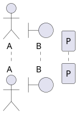
</td>
</tr>

</table>

 

<table>
<colgroup>
    <col style="width: 30%">
    <col style="width: 50%">
<colgroup>

<tr>
<th>객체 색상</th><th>Render</th>
</tr>

<tr>
<td>

`#colorname` or `#colorcode` 사용하여 지정

@startuml  
participant P #mediumseagreen 
actor A #magenta 
boundary B #13ab32  
@enduml
</td>
<td>

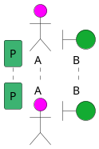
</td>
</tr>

</table>

 

<table>
<colgroup>
    <col style="width: 30%">
    <col style="width: 50%">
<colgroup>

<tr>
<th>객체 세부 선언</th><th>Render</th>
</tr>

<tr>
<td>

`대괄호 []` 사용하여 지정

@startuml  
actor A [ 
    =Upper 
    ---- 
    ""Lower"" 
]  
@enduml
</td>
<td>

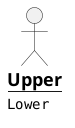
</td>
</tr>

</table>

 

### 3.2. 시퀀스 사용법

 

#### 3.2.1. 시퀀스 선언

 

<table>
<colgroup>
    <col style="width: 30%">
    <col style="width: 50%">
<colgroup>

<tr>
<th>시퀀스 선언</th><th>Render</th>
</tr>

<tr>
<td>

@startuml  
a->b:message 
a-->b 
a<->b 
a->xb 
a->ob 
a-\b 
a-/b 
a->>b 
a-\\b 
a-//b 
a->a  
@enduml
</td>
<td>

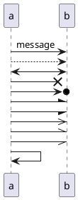
</td>
</tr>

</table>

 

#### 3.2.2. 시퀀스 활용 

 

<table>
<colgroup>
    <col style="width: 30%">
    <col style="width: 50%">
<colgroup>

<tr>
<th>시퀀스 색상</th><th>Render</th>
</tr>

<tr>
<td>

`#색상이름` or `#색상코드` 사용하여 지정

@startuml  
a-[#cyan]>b:Change by name 
a-[#1204fb]>b:Change by code  
@enduml
</td>
<td>

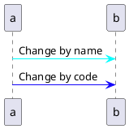
</td>
</tr>

</table>

 

<table>
<colgroup>
    <col style="width: 30%">
    <col style="width: 50%">
<colgroup>

<tr>
<th>여러 줄 메시징</th><th>Render</th>
</tr>

<tr>
<td>

`\n` 사용하여 여러 줄 메시지 삽입

@startuml  
a->b:This is\nvery long and\nmultiline\nmessage  
@enduml
</td>
<td>

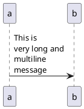
</td>
</tr>

</table>

 

<table>
<colgroup>
    <col style="width: 30%">
    <col style="width: 50%">
<colgroup>

<tr>
<th>메시지 번호</th><th>Render</th>
</tr>

<tr>
<td>

`autonumber` 키워드로 번호 삽입

@startuml  
a->b:This is\nvery long and\nmultiline\nmessage  
@enduml
</td>
<td>

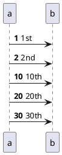
</td>
</tr>

</table>

 

## 4. 기타